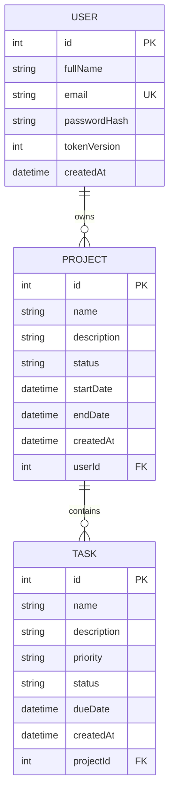

# Database schema

## Tables

**User**: `id` (PK), `fullName`, `email` (unique), `passwordHash` (bcrypt), `tokenVersion` (increased on logout), `createdAt`

**Project**: `id` (PK), `name`, `description`, `status` (NOT_STARTED, IN_PROGRESS, COMPLETED), `startDate`, `endDate`, `createdAt`, `userId` (FK to User)

**Task**: `id` (PK), `name`, `description`, `priority` (LOW, MEDIUM, HIGH), `status` (PENDING, IN_PROGRESS, COMPLETED), `dueDate`, `createdAt`, `projectId` (FK to Project)

## Relationships
- One user has many projects: `Project.userId` references `User.id` (ON DELETE CASCADE)
- One project has many tasks: `Task.projectId` references `Project.id` (ON DELETE CASCADE)
- A task has no `userId`. Ownership is derived through its project, which keeps the schema normalized.
- Source of truth: `backend/prisma/schema.prisma`
