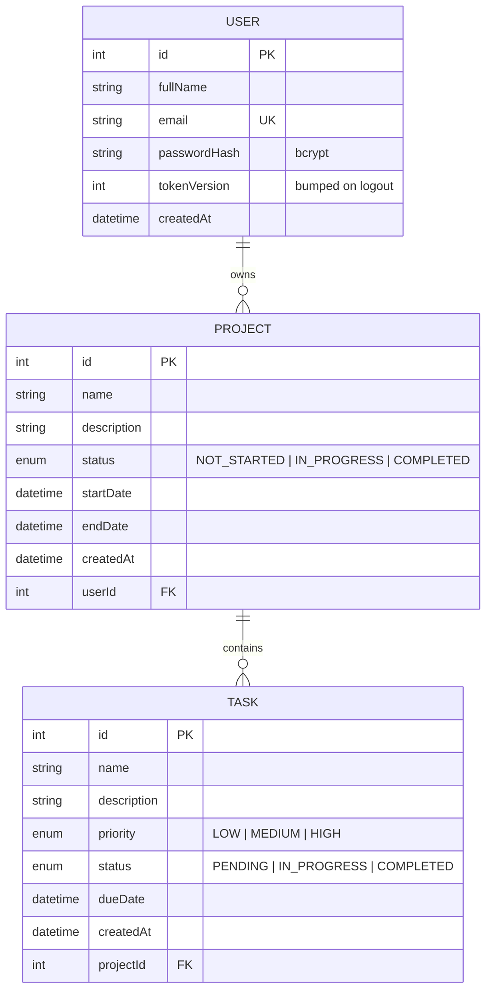

# Database schema

- `Project.userId -> User.id` (ON DELETE CASCADE)
- `Task.projectId -> Project.id` (ON DELETE CASCADE)
- A task has no `userId`: ownership is derived through its project, which keeps the schema normalized.
- Source of truth: `backend/prisma/schema.prisma`.
